
# Git and Github Introduction

| Nama  | Division        | Sub-Division  |
| ----- | ---------- | ---------- |
| Achmad Javier Eka Caraka   | ELC | Electrical Design |

## Early Procedure
### 1. Download and Install Git 
    https://git-scm.com/downloads
### 2. Create GitHub Account
    https://github.com/join
### 3. Configurate Setting on Git Bash
    git config --global user.(insert username)
    git config --global user.(insert email)
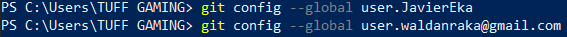
### 4. Create SSH Keys on GitHub
#### A. Open GitHub Setting -> SSH and GPG Keys -> New SSH Keys
#### B. To Get the Key, Input These Command on Git Bash
    ssh-keygen -t ed25519 -C (insert email.com)
    *Press Enter 3 Times*
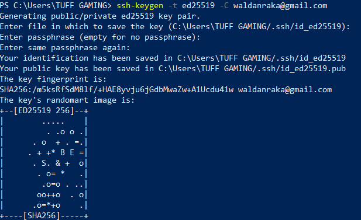

##### Copy The Key With These Command 
    cat .ssh/id_ed25519.pub
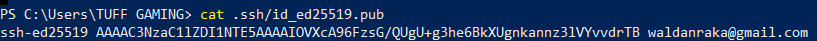
#### C. Paste The Key to Key Coloumn on Github
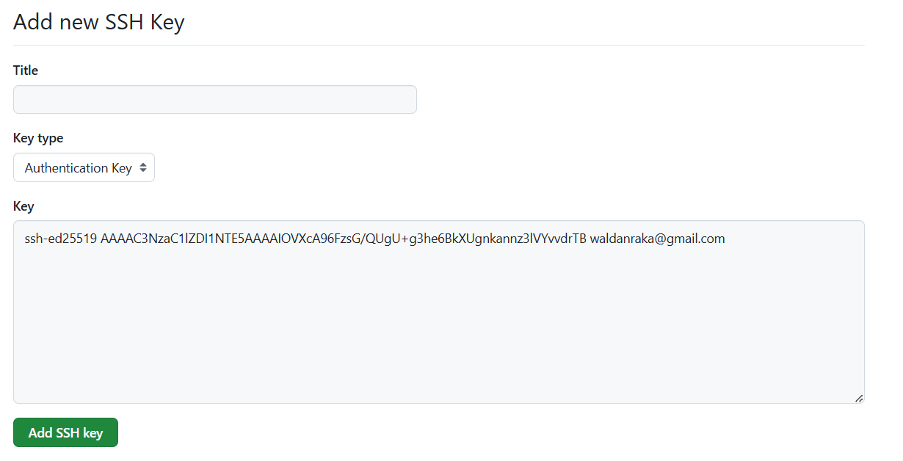
## Create Repository
### 1. Open GitHub Dashboard
    https://github.com/
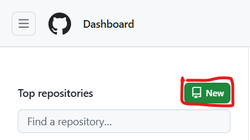
### 2. Setting The Repository to Your Preference
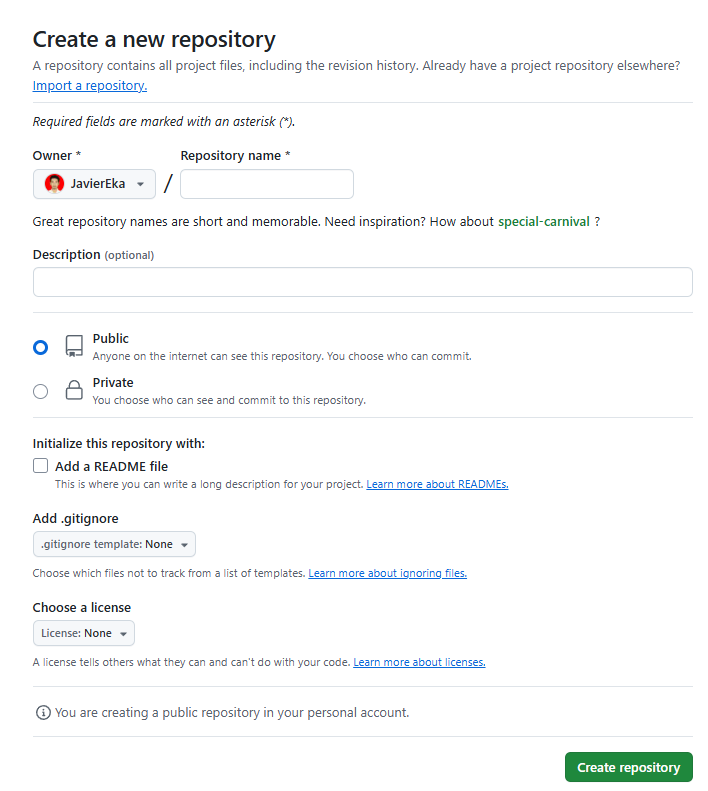
### 3. Copy Link of The Repository
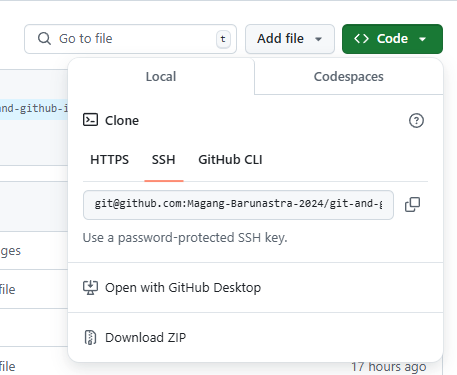
### 4. Connect The Repository on GitHub to The Repository on Local
#### There are 2 Ways to Connect
##### a. **Manual**
###### - Create folder in File Explorer 
**! Name The Folder Must Same as The Repository !**
###### - Open The Folder on Git Bash
###### - Insert This Command on Git Bash
    git init
    git remote add origin (Link of The Respository)
    git branch -M main
###### - Check if The Local Folder Same as The Repository with This Command
    git pull origin (Branch name)
##### b. **Git Clone**
##### - Open Folder on Git Bash
##### - Insert This Command on Git Bash
    git clone (Link of The Respository)
##### - Folder Will be Created in File Explorer and Open The Folder on Git Bash
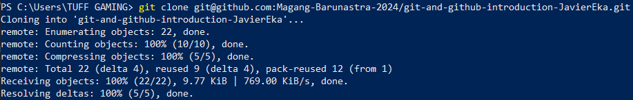
##### - Insert This Command on Git Bash
    git branch -M main
## Push File from Local to GitHub
### To Push File from Local to Github, Insert This Command on Git Bash
    git add .
    git commit -m "(Desricption The Change)"
    push origin (Branch Name)
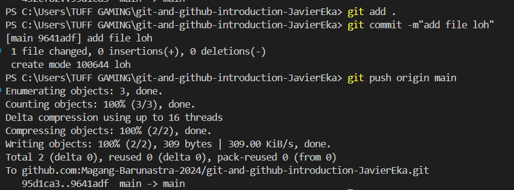
## Create New Branch in Github 
### To Make A New Branch, Insert This Command on Git Bash
    git checkout -b (Branch Name)
### To Move Into The New Branch, Insert This Command on Git Bash
    git checkout (Branch Name)
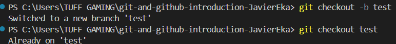
## Delete Branch in Github
### To Delete A Branch, Move To The Other Branch First 
    git checkout (Branch Name)
### Insert This Command On Git Bash to Delete The Branch
    git branch -d (Branch Name)
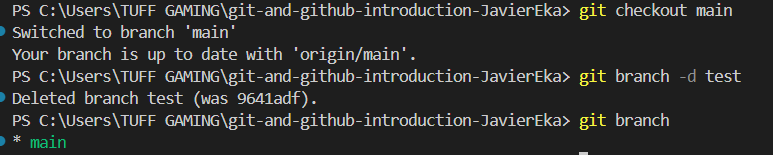
## Merge Branch in Github
### To Merge Branches, Choose The Branch That Will be The Main Branch
    git checkout (Branch Name)
### Insert This Command on Git Bash to Merge Branches
    git merge (Branch Name)
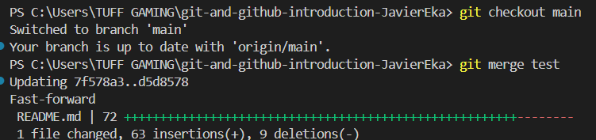
